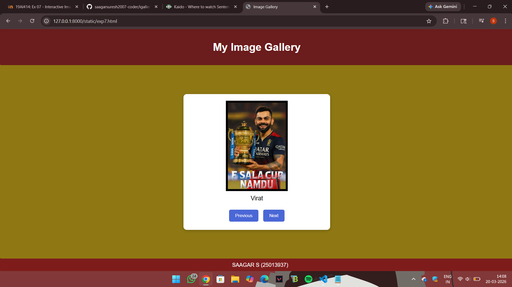

# Ex.07 Design of Interactive Image Gallery
## Date:20.03.2026

## AIM:
To design a web application for an inteactive image gallery for a minimum five images with next and previous buttons.

## DESIGN STEPS:

### Step 1:
Clone the github repository and create Django admin interface.

### Step 2:
Change settings.py file to allow request from all hosts.

### Step 3:
Use CSS for positioning and styling.

### Step 4:
Write JavaScript program for implementing interactivity.

### Step 5:
Validate the HTML and CSS code.

### Step 6:
Publish the website in the given URL.

## PROGRAM:
```
<html>
<head>
    <title>Image Gallery</title>

    <style>
        body{
            margin:0;
            font-family:Arial, sans-serif;
            background-color:#8f7813;
        }

        .top{
            background-color:#6b1c1c;
            color:white;
            text-align:center;
            padding:15px;
        }

        .main{
            display:flex;
            justify-content:center;
            align-items:center;
            height:80vh;
        }

        .gallery{
            background-color:white;
            width:400px;
        
            padding:20px;
            text-align:center;
            border-radius:10px;
            box-shadow:0px 3px 10px rgba(0,0,0,0.2);
        }

        .gallery-box img{
            width:100%;
            height: 420px;
            border-radius:8px;
            object-fit:cover;
        }

        #caption{
            font-size:18px;
            margin-top:12px;
        }

        .a1{
            margin-top:15px;
        }

        button{
            background-color:#4a67d6;
            color:white;
            border:none;
            padding:10px 18px;
            margin:5px;
            border-radius:5px;
            cursor:pointer;
        }

        button:hover{
            background-color:#3249a8;
        }

        .down{
            background-color:#7e1c1c;
            color:white;
            text-align:center;
            padding:10px;
            position:fixed;
            bottom:0;
            width:100%;
        }
    </style>

</head>
<body>

    <div class="top">
        <h1>My Image Gallery</h1>
    </div>

    <div class="main">
        <div class="gallery">
            

            <p id="caption">FAV PICS</p>

            <div class="a1">
                <button onclick="showPrevious()">Previous</button>
                <button onclick="showNext()">Next</button>
            </div>
        </div>
    </div>

    <div class="down">
        SAAGAR S (25013937)
    </div>

    
    <script>
        var gallery = [
            {image: "king.jpg", caption: "Virat"},
            {image: "god.jpeg", caption: "Sachein"},
            {image: "msd.jpeg", caption: "MSD"},
            {image: "abd.jpeg", caption: "Alien"},
            {image: "download (2).jpeg", caption: "AOT Eren"}
        ];

        var index = 0;

        function displayImage() {
            document.getElementById("galleryImage").src = gallery[index].image;
            document.getElementById("caption").innerHTML = gallery[index].caption;
        }

        function showNext() {
            index = index + 1;

            if(index == gallery.length) {
                index = 0;
            }

            displayImage();
        }

        function showPrevious() {
            index = index - 1;

            if(index < 0) {
                index = gallery.length - 1;
            }

            displayImage();
        }

        displayImage();
    </script>

</body>
</html>
```
## OUTPUT:

## RESULT:
The program for designing an interactive image gallery using HTML, CSS and JavaScript is executed successfully.
